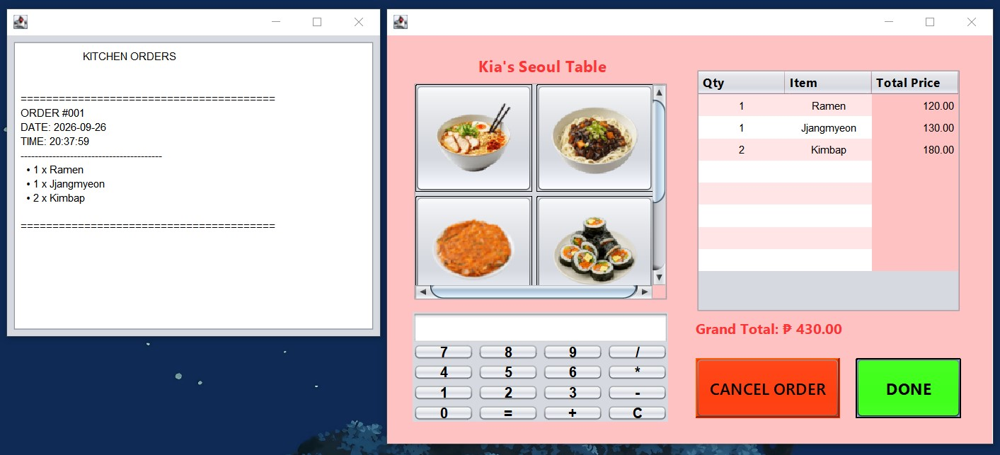

# 🍜 Food Ordering & Kitchen System

> A Java Swing-based food ordering system with an integrated kitchen terminal for managing and displaying customer orders.

---

## 📌 About the Project

The **Food Ordering & Kitchen System** is a Java Swing desktop application developed as an academic project. It combines a customer-facing food ordering interface with a kitchen terminal that monitors and displays incoming orders.

The system supports menu selection, order calculation, receipt printing, order tracking, and communication between the food ordering system and kitchen terminal through a shared `Orders.txt` file.

---

## 👀 Preview

### Food Ordering & Kitchen System


---

## ✨ Features

### 🍱 Food Ordering System
- Kiosk-style startup screen
- Menu showcase
- Quantity selection
- Order table with item, quantity, and price
- Automatic order total calculation
- Cancel and complete order functions
- Order number, date, and time tracking
- Receipt printing

### 👨‍🍳 Kitchen Terminal
- Real-time order monitoring
- Automatic detection of new orders
- Order number display
- Date and time display
- Clean kitchen-friendly order format
- Persistent order history through `Orders.txt`

---

## 🧩 Key Systems

### ⭐ Food Ordering System

The customer-facing application allows users to browse the menu, select quantities, review their order, calculate the total, and complete the transaction. Completed orders are saved to `Orders.txt` for the kitchen terminal.

### ⭐ Kitchen Terminal

The kitchen terminal continuously monitors `Orders.txt` and automatically updates when a new order is received. Each order is displayed with its order number, date, time, and items to help organize kitchen operations.

### ⭐ Order Communication

The two applications communicate through a shared `Orders.txt` file:

```text
Food Ordering System
        ↓
    Orders.txt
        ↓
Kitchen Terminal
```

## 🛠️ Technologies Used

| Technology | Purpose |
|---|---|
| **Java** | Core application logic and programming |
| **Java Swing** | Graphical user interface
| **NetBeans** | Development environment |
| **Git & GitHub** | Version control and project distribution |
| **ChatGPT** | Troubleshooting and development assistance |

---

## 🚀 Running from Source

### Requirements

- Java JDK 25
- Apache NetBeans IDE 28 (recommended)
- Windows operating system

### Steps

1. Clone the repository:

   ```bash
   git clone https://github.com/kiacodesss/food-ordering-and-kitchen-system.git
   ```
   
2. Open the project in NetBeans.
3. Allow NetbBeans to load and configure the project.
4. Create the following folder on your local drive:

   ```bash
   C:\Kitchen Terminal\
   ```
   
6. Create an empty `Orders.txt` file inside the folder.

   ```bash
   C:\Kitchen Terminal\Orders.txt
   ```
8. Build the project in NetBeans.
9. Run the application.

---

## 📦 Release

A ready-to-run release is available under GitHub Releases.

The release package includes:
- **FoodOrderingSystem.jar**
- **KitchenTerminalUI.jar**

These JAR files provide the compiled versions of the Food Ordering System and Kitchen Terminal.

---

## 🎓 Project Information

This project was developed as part of an academic project for the Intermediate Programming course. It was created to apply and demonstrate Java programming concepts, GUI development, file handling, and application integration using Java and NetBeans.

## 📄 License

This project is for educational and portfolio purposes.
